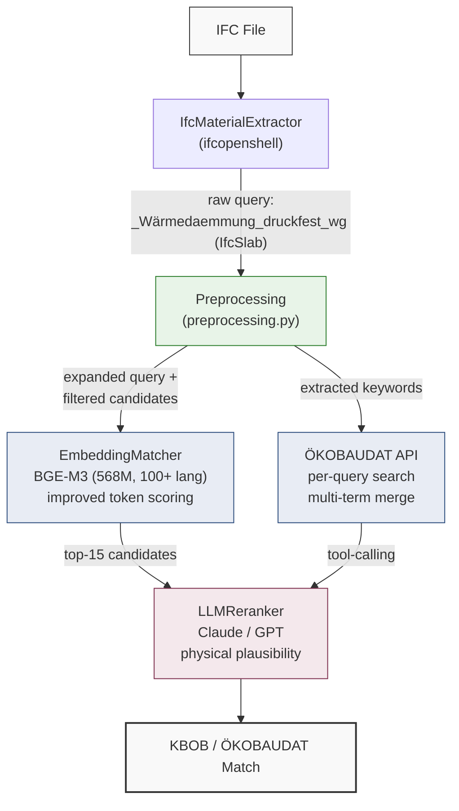

# IFC-to-LCA Material Matching: From Single-Model Cosine Similarity to Multi-Source Hybrid Pipelines

## Install

Requires **Python 3.11+**.

```bash
python3 -m venv .venv
source .venv/bin/activate

pip install -e .
# Optional: for LLM reranking with Claude
pip install -e ".[anthropic]"
# Optional: for development/testing
pip install -e ".[dev]"
```

### Environment variables

Create a `.env` file in the project root:

```bash
LCADATA_API_KEY=your-key        # Required for KBOB matching (from lcadata.ch)
ANTHROPIC_API_KEY=sk-ant-...    # Optional, for Claude reranking
OPENAI_API_KEY=sk-...           # Optional, for GPT reranking
```

## Usage

### Match materials from an IFC file

```bash
# Match against KBOB (322 Swiss LCA materials, requires LCADATA_API_KEY)
ifc-match match-ifc --kbob model.ifc

# Match against ÖKOBAUDAT (~1M German EPDs, no API key needed)
ifc-match match-ifc --oekobaudat model.ifc

# Embedding-only mode (faster, no LLM API cost)
ifc-match match-ifc --kbob --mode embedding model.ifc

# Save results to JSON
ifc-match match-ifc --kbob model.ifc -o results.json
```

### Match a single query

```bash
# Against inline candidates
ifc-match match "Stahlbeton C30/37" --candidates "Hochbaubeton" "Betonfertigteil" "Armierungsstahl"

# Against a database file
ifc-match match "rigid insulation" --database-file materials.json --top-k 5

# With element type context (helps category filtering)
ifc-match match "Holz" --database-file materials.json --element-type IfcWall
```

### Inspect an IFC file

```bash
# Summary of elements and materials
ifc-match ifc-import --summary model.ifc

# List all elements with materials
ifc-match ifc-import model.ifc

# Detailed output as JSON
ifc-match ifc-import --verbose --json model.ifc
```

### Geometric proximity analysis

```bash
# Find adjacent elements in an IFC model
ifc-match proximity model.ifc

# Custom tolerances
ifc-match proximity model.ifc --tolerance 0.02 --near-threshold 1.0
```

### Building Circularity Indicator (BCI)

```bash
# Calculate BCI from Neo4j graph
ifc-match bci --neo4j-uri bolt://localhost:7687

# Simulate changing a connection type
ifc-match bci --simulate conn-1:BOLTED
```

## Project structure

```
ifc_matching/               Core package
├── cli.py                  CLI entry point
├── preprocessing.py        Query cleaning, synonyms, category filtering, keyword extraction
├── ifc_extractor.py        IFC material extraction (ifcopenshell)
├── engines/
│   ├── embedding.py        BGE-M3 embedding matcher (improved token scoring)
│   ├── reranker.py         LLM reranker (Claude/GPT) with ÖKOBAUDAT tool-calling
│   └── hybrid.py           Retrieve-and-rerank pipeline
├── databases/
│   ├── kbob_client.py      KBOB API client with caching
│   └── oekobaudat_client.py  ÖKOBAUDAT search API client
├── geometry/
│   └── proximity.py        Bounding box adjacency analysis
└── graph/
    ├── circularity.py      BCI/MCI/DI calculations
    └── neo4j_store.py      Neo4j graph persistence

baseline/                   Forth (2024) original code for reference
benchmarks/                 Reproducibility benchmarks (56 tests, 7 IFC files)
tests/                      Unit tests and test documentation
```

## Running tests

```bash
pytest tests/ -v
```

## Running benchmarks

```bash
# KBOB benchmark (56 tests from 7 IFC files)
python benchmarks/benchmark_multimodel.py

# ÖKOBAUDAT benchmark (same 56 queries)
python benchmarks/benchmark_oekobaudat.py
```

---

## Abstract

Automated matching of IFC building material descriptions to Life Cycle Assessment (LCA) databases is essential for scalable environmental impact assessment of buildings. This work extends the semantic textual matching approach of Forth (2024) — which uses single-model cosine similarity — with a multi-stage pipeline incorporating (1) domain-specific preprocessing, (2) a stronger multilingual embedding model, (3) improved token-level scoring, (4) LLM-based reranking with tool-calling, and (5) multi-source database support (KBOB and ÖKOBAUDAT).

Evaluated on **56 test cases** from **7 real IFC files** across 3 languages and 12 material categories:
- KBOB matching: **50% acceptable** (embedding + preprocessing) vs 29% baseline, with hybrid LLM reranking reaching **54%** — all without requiring fine-tuned models
- ÖKOBAUDAT matching: **88% acceptable** via keyword extraction and multi-term API search, from a **7% baseline** using raw queries

All improvements are achieved through engineering — preprocessing, architecture, and prompting — not model fine-tuning, making the approach immediately transferable to other LCA databases.

---

## 1. Background and Baseline

### 1.1 The IFC material matching problem

IFC (Industry Foundation Classes) files from different BIM authoring tools use inconsistent, noisy, multilingual material naming. For example, a concrete wall slab might appear as:

- `_Beton_C30-37_wg` (Revit Swiss convention, German)
- `f2_beton ihwg_C35/45` (Dutch project code)
- `Concrete - Cast In Situ` (English, clean)
- `Stahlbeton 65690` (German with numeric element ID)

These must be matched to LCA database entries like KBOB's `Hochbaubeton (C20/25 bis C50/60)` or ÖKOBAUDAT's `Beton C30/37 XC4 XF1 XA1 F3 16 M ECOPact` for embodied carbon calculations.

### 1.2 Forth (2024) baseline approach

The baseline is the [`ifcProductMatching`](https://github.com/kasforth/ifcProductMatching) system by Forth (2024), developed as part of the dissertation *"BIM-based semantic enrichment for environmental analyses using Large Language Models"* at TU Munich. The original system:

```python
# Original scoring logic (matchIfcProduct.py)
class IfcProductMatches:
    def matchIfcProduct(self, ifcProductName, filtereddatabase, llm):
        for dataset in filtereddatabase:
            # 1. Whole-term cosine similarity
            termCosSim = cos_sim(llm.encode(ifcProductName), llm.encode(dataset))

            # 2. Token-level: split on [ :\-_], compute all pairwise cosines
            tokenCosSim = []
            for token_ifc in re.split(r"[ :\-_]", ifcProductName):
                for token_db in re.split(r"[ :\-_]", dataset):
                    tokenCosSim.append(cos_sim(llm.encode(token_ifc), llm.encode(token_db)))

            # 3. Final score = max(whole-term, max-of-all-token-pairs)
            score = max(termCosSim, max(tokenCosSim))
```

**Key characteristics:**

| Aspect | Forth (2024) baseline |
|--------|----------------------|
| Model | BERT-base-german-cased (110M params) or fine-tuned variants |
| Scoring | max(term_cosine, max_token_cosine) |
| Input preprocessing | None |
| Element-type context | Not used |
| Database support | Single pre-filtered list (external) |
| Languages | Model-dependent (German-cased or English) |
| Multi-stage reasoning | No |

The approach was validated on three use cases with fine-tuned models:
- Use Case 1: IfcElement → LCA database (BERT-base-german-cased)
- Use Case 2: IfcMaterial → Material Passports ([kforth/IfcMaterial2MP](https://huggingface.co/kforth/IfcMaterial2MP))
- Use Case 3: IfcSpace → Space Types ([kforth/IfcSpace2SpaceTypes](https://huggingface.co/kforth/IfcSpace2SpaceTypes))

### 1.3 Identified limitations

When applied to real-world IFC files with noisy, multilingual material names against the full 322-entry KBOB database, the baseline approach (using BGE-M3 as a stronger drop-in model) achieved only **29% acceptable accuracy** on the 56-test benchmark. Five root causes were identified:

1. **No input preprocessing.** Tool-specific noise (`_wg` suffixes, numeric IDs, underscore conventions) degrades embedding quality. The model receives `_Wärmedaemmung_druckfest_wg` instead of `Wärmedämmung druckfest`.
2. **Single-token score collapse.** Taking `max(all_token_pairs)` means any candidate sharing one common word (e.g. "Beton") scores 1.0 regardless of overall relevance. With 322 candidates, many share common German construction terms.
3. **No cross-lingual bridging.** English "brick" has zero lexical overlap with German "Backstein". Dutch "staal" doesn't directly match "Stahlprofil". Embeddings alone cannot bridge domain-specific construction terminology across languages.
4. **No structural context.** A material used in an `IfcBeam` is far more likely to be steel or concrete than ceramic tile, but this context is discarded.
5. **Single-database, fixed-list architecture.** Databases like ÖKOBAUDAT with millions of entries cannot be loaded as a fixed candidate list — they require search-based access with intelligent query formulation.

---

## 2. Approach: Architecture and Changes

The single-class matching was restructured into a **modular multi-stage pipeline** with five independent layers of improvement. Each layer was evaluated incrementally.

### 2.1 System architecture



### 2.2 Detailed changes from baseline

#### Change 1: Query preprocessing (preprocessing.py — new)

| Stage | What it does | Example |
|-------|-------------|---------|
| Clean | Strip tool noise: `_wg` suffix, `f2_`/`h2_`/`DD_`/`AT_` prefixes, numeric IDs (6+ digits), RGB codes, underscore→space, ASCII→umlaut (`ae`→`ä`) | `_Wärmedaemmung_druckfest_wg` → `Wärmedämmung druckfest` |
| Synonym expand | Map EN/NL/generic DE terms to specific German DB entries via 47 dictionary mappings | `staal S235` → `staal S235 \| Stahl Stahlprofil` |
| Category filter | Narrow candidates by IFC element type using curated category→prefix mappings for both KBOB and ÖKOBAUDAT | `IfcBeam` → only categories 01, 06, 07 (73/322 KBOB entries) |
| Keyword extract | For ÖKOBAUDAT API: extract clean German search terms from any IFC query; 100+ multilingual keyword→German mappings | `f2_beton ihwg_C35/45` → `["Beton"]` |

#### Change 2: Embedding model upgrade

| | Forth (2024) | This work |
|---|---|---|
| Model | `bert-base-german-cased` (110M) | `BAAI/bge-m3` (568M) |
| Languages | German only (or English with `-uncased`) | 100+ languages natively |
| Context window | 512 tokens | 8,192 tokens |
| Training | Pre-trained (or fine-tuned per use case) | Pre-trained, no fine-tuning needed |
| Multilingual matching | Requires separate model per language | Single model handles DE/EN/NL/FR |

BGE-M3 was selected after testing against `paraphrase-multilingual-MiniLM-L12-v2` (118M) and `all-MiniLM-L6-v2` (English-only, 22M). BGE-M3 showed consistent improvement on cross-lingual queries without requiring fine-tuning.

#### Change 3: Token scoring fix

**Original (Forth 2024):** `score = max(term_cosine, max(all_pairwise_token_cosines))`

This creates a **score collapse** problem: any candidate containing a single common word (e.g. "Beton" appears in 21+ KBOB entries across 5 categories) scores 1.0 regardless of the overall query.

**Fix:** Improved token scoring that rewards *coverage* across all query tokens:

```
tok_score = 0.6 × mean(best_match_per_query_token) + 0.4 × max(best_match_per_query_token)
```

The mean component ensures a candidate must match *many* query tokens to score highly, not just one. The max component preserves sensitivity to strong individual matches. Additionally, all tokens (query + candidate) are encoded in a **single batch call** rather than one-at-a-time, which reduces redundant computation for large candidate lists.

#### Change 4: LLM reranker with tool-calling (reranker.py — new)

A second-stage LLM reranker receives the top-k embedding candidates and re-scores them based on **physical plausibility** and **domain knowledge**:

- Understands that "vorfabrizierte Elemente" + "C50/60" implies precast high-strength concrete
- Knows EPDM is a rubber membrane, not a polystyrene product
- Can reason about element type context (IfcBeam → structural material)

For ÖKOBAUDAT, the reranker has access to a **tool-calling interface** that lets it dynamically search for additional EPD candidates during its reasoning process:

```
LLM thinks: "The initial candidates don't include any EPDM-specific EPDs. Let me search for 'EPDM Dachabdichtung'..."
→ calls oekobaudat_search(query="EPDM", class_hint="6.3")
→ receives additional candidates
→ re-ranks the merged list
```

Supports both Anthropic (Claude) and OpenAI (GPT) backends with provider-specific tool schemas. Maximum 3 tool iterations to prevent runaway loops.

#### Change 5: Multi-source database support

| | KBOB | ÖKOBAUDAT |
|---|---|---|
| Entries | 322 materials | ~1M EPDs |
| Access | Full list via API | Per-query search API |
| Language | German | German |
| IDs | Hierarchical (e.g. `01.002`) | ClassId (e.g. `1.4.01`) |
| Compliance | N/A | EN 15804+A2 (default) |
| Client | `kbob_client.py` | `oekobaudat_client.py` |

ÖKOBAUDAT's ILCD/ServiceAPI does AND full-text matching, so raw IFC queries fail catastrophically (50/56 return zero results). The keyword extraction layer (`extract_oekobaudat_search_terms`) maps any noisy multilingual IFC query to clean German API search terms, then merges results from multiple fallback terms.

---

## 3. Benchmark Design

### 3.1 Test set construction

The benchmark comprises **56 test cases** from **7 real IFC files** covering 3 BIM authoring tools (Revit, ArchiCAD, Tekla), 3 source languages (DE, EN, NL), and 12 material categories. Material queries were extracted programmatically from IFC files using `ifcopenshell`. Each query was matched against the full **322-entry KBOB database** (lcadata.ch) and the **ÖKOBAUDAT search API** (~1M EPDs, EN 15804+A2 compliance).

Ground truth was constructed by assigning each query to one or more acceptable KBOB category-ID prefixes (e.g. `01.*` for concrete) and ÖKOBAUDAT classific_id prefixes (e.g. `1.4.*` for Mörtel und Beton), based on the material semantics and the respective database category definitions. The full ground truth definitions are included in `benchmark_multimodel.py` and `benchmark_oekobaudat.py` for inspection and reproduction.

#### IFC sources

| File | Origin | Tool | Language | Materials |
|------|--------|------|----------|-----------|
| `own_model.ifc` | Own Swiss model | Revit | DE (Swiss) | 5 |
| `digital_hub_arc.ifc` | IFC-Bench / RWTH Aachen | Revit | DE (clean) | 28 |
| `fzk_house_arc.ifc` | IFC-Bench / KIT | ArchiCAD | DE (short) | 6 |
| `smiley_west_arc.ifc` | IFC-Bench / KIT | ArchiCAD | DE (with IDs) | 12 |
| `duplex_arc.ifc` | IFC-Bench / buildingSMART | Revit | EN | 14 |
| `sixty5_str.ifc` | IFC-Bench / buildingSMART | Tekla | NL/EN | 8 |
| `sixty5_facade.ifc` | IFC-Bench / buildingSMART | Tekla | NL | 3 |

The IFC files contain 76 raw material names in total. After removing unmatchable entries (e.g. `Air Space`, `Stud Layer`, generic fillers) and deduplicating semantically identical queries from the same file, **56 test cases** remain.

#### Category distribution

| Category | Tests | Example queries |
|----------|-------|----------------|
| Concrete | 16 | `Ortbeton - bewehrt`, `f2_beton ihwg_C35/45`, `Concrete - Cast In Situ` |
| Insulation | 8 | `_Wärmedaemmung_druckfest_wg`, `Dämmung - hart`, `AT_Isolatie_140mm` |
| Steel | 7 | `Stahl`, `h2_staal_ S235`, `Metal - Steel - 345 MPa` |
| Gypsum | 5 | `Trockenbau - Rigips Die Blaue RFI`, `Plasterboard`, `Gips 275646950` |
| Masonry | 5 | `_Mauerwerk - Kalksandstein_wg`, `Masonry - Brick` |
| Wood | 5 | `Holz`, `Wood - Dimensional Lumber`, `Wood - Sheathing - plywood` |
| Glass | 3 | `Glas`, `Glas - Isolierverglasung klar` |
| Membrane | 2 | `Dachdeckung - Bitumenbahn`, `Roofing - EPDM Membrane` |
| Stone | 2 | `Naturstein - Granit grau`, `Dachdeckung - Kies` |
| Aluminium | 1 | `Aluminium 587913947` |
| Facade | 1 | `Faserzementplatte (Equitone - natura)` |
| Tile | 1 | `Ceramic Tile` |

#### Scoring

- **Strict**: Top-1 result matches the target database entry by name
- **Acceptable**: Top-1 result's category ID starts with any of the assigned acceptable prefixes (KBOB ID or ÖKOBAUDAT classific_id)

---

## 4. Results: KBOB Database (322 entries)

### 4.1 Approach comparison

| # | Approach | Strict | Acceptable | Notes |
|---|----------|--------|------------|-------|
| 1 | Embedding BGE-M3 (baseline scoring) | 12% (7/56) | 29% (16/56) | Forth-style scoring with stronger model |
| 2 | **Embedding BGE-M3 + preprocessing** | **18% (10/56)** | **50% (28/56)** | +72% relative improvement, zero cost |
| 3 | Hybrid: BGE-M3 + Claude (no preprocess) | 29% (16/56) | 54% (30/56) | LLM reranking adds domain reasoning |
| 4 | Hybrid: BGE-M3 + GPT-5.2 (no preprocess) | 32% (18/56) | 48% (27/56) | GPT higher strict, lower acceptable |

**Key finding:** Preprocessing alone (row 2) reaches 50% acceptable accuracy at **zero API cost**, closing most of the gap to LLM reranking (row 3, 54%) which requires ~$0.03/query and significantly longer runtime.

### 4.2 Results by material category

| Category | Tests | Emb baseline | Emb + preproc | +Claude | +GPT |
|----------|-------|-------------|---------------|---------|------|
| Concrete | 16 | 7 (44%) | 10 (63%) | 15 (94%) | 12 (75%) |
| Insulation | 8 | 1 (13%) | 4 (50%) | 4 (50%) | 4 (50%) |
| Steel | 7 | 1 (14%) | 2 (29%) | 1 (14%) | 2 (29%) |
| Masonry | 5 | 2 (40%) | 3 (60%) | 3 (60%) | 2 (40%) |
| Gypsum | 5 | 1 (20%) | 2 (40%) | 0 (0%) | 0 (0%) |
| Wood | 5 | 0 (0%) | 1 (20%) | 1 (20%) | 1 (20%) |
| Glass | 3 | 1 (33%) | 1 (33%) | 1 (33%) | 1 (33%) |
| Membrane | 2 | 1 (50%) | 2 (100%) | 2 (100%) | 2 (100%) |
| Stone | 2 | 0 (0%) | 0 (0%) | 0 (0%) | 0 (0%) |
| Aluminium | 1 | 0 (0%) | 1 (100%) | 1 (100%) | 1 (100%) |
| Facade | 1 | 1 (100%) | 1 (100%) | 1 (100%) | 1 (100%) |
| Tile | 1 | 1 (100%) | 1 (100%) | 1 (100%) | 1 (100%) |

### 4.3 Results by language

| Language | Tests | Emb baseline | Emb + preproc | +Claude | +GPT |
|----------|-------|-------------|---------------|---------|------|
| German | 35 | 11 (31%) | 19 (54%) | 23 (66%) | 20 (57%) |
| English | 13 | 3 (23%) | 6 (46%) | 4 (31%) | 4 (31%) |
| Dutch | 8 | 2 (25%) | 3 (38%) | 3 (38%) | 3 (38%) |

Preprocessing helps English queries more than LLM reranking (+23pp vs +8pp) because synonym expansion bridges the language gap at retrieval time.

---

## 5. Results: ÖKOBAUDAT Database (~1M EPDs)

### 5.1 Approach comparison

The same 56 IFC queries were run against the ÖKOBAUDAT search API (EN 15804+A2 compliance, 2021-II datastock).

| # | Approach | Acceptable | No Results |
|---|----------|-----------|------------|
| 1 | Raw query → API search → BGE-M3 | 7% (4/56) | 50 |
| 2 | Preprocess → API search → BGE-M3 | 18% (10/56) | 45 |
| 3 | **Keyword extract → multi-search → BGE-M3** | **88% (49/56)** | **0** |

**Key finding:** The ÖKOBAUDAT API does AND full-text matching. Multi-word queries like `"Ortbeton - bewehrt"` return zero results because no EPD name contains both words. Keyword extraction maps any IFC query to clean German terms (e.g. `["Beton"]`), then merges results from multiple fallback terms. This eliminates all zero-result queries.

### 5.2 Results by category (Approach 3)

| Category | Score | Category | Score |
|----------|-------|----------|-------|
| Concrete | 16/16 | Steel | 4/7 |
| Masonry | 5/5 | Glass | 3/3 |
| Gypsum | 5/5 | Wood | 5/5 |
| Insulation | 5/8 | Membrane | 2/2 |
| Aluminium | 1/1 | Tile | 0/1 |
| Facade | 1/1 | Stone | 2/2 |

### 5.3 Results by language (Approach 3)

| Language | Tests | Acceptable |
|----------|-------|-----------|
| German | 35 | 30 (86%) |
| English | 13 | 11 (85%) |
| Dutch | 8 | 7 (88%) |

Cross-lingual accuracy is nearly uniform because keyword extraction translates all queries to German before API search, bypassing the language barrier entirely.

### 5.4 ÖKOBAUDAT failure analysis

The 7 remaining failures are all **embedding ranking** errors — the correct candidate was found by the search but ranked #2 or #3:

| Query | Got (rank 1) | Correct (rank 2–3) | Root cause |
|-------|--------------|--------------------|------------|
| `Dämmung - hart` | Mineralwolle (2.1.01) | XPS (2.3.01) | "Dämmung" closer to "Mineralwolle Dämmung" than "Polystyrol Dämmstoff" |
| `Isolierung, hart` | Mineralwolle (2.1.01) | XPS/EPS (2.2–2.4) | Same root cause: generic "Dämmung" search returns Mineralwolle first |
| `Semi-rigid insulation` | XPS (2.3.01) | Glaswolle (2.1.02) | "insulation" semantically closer to XPS label |
| `DD staal Jordahl` | Rolltore (7.6.01) | Stahl profiles (4.1) | Brand name "Jordahl" causes false similarity |
| `Metall - Edelstahl` | EoL Edelstahl (100.1.04) | Edelstahl-Rohr (4.2.03) | End-of-life dataset name is closer lexically |
| `Metall - Zink` | Stahl verzinkt (4.1.04) | — | No pure Zink entry in ÖKOBAUDAT A2 results |
| `Ceramic Tile` | Glaskeramik (7.2.02) | Steinzeugfliesen (1.3.07) | "Keramik" matches "Glaskeramik" more than "Steinzeug" |

These are exactly the cases where **LLM reranking** adds value — the correct candidate is present in the shortlist but requires domain reasoning to rank correctly.

---

## 6. Analysis: What Each Improvement Contributes

### 6.1 Preprocessing is the highest-ROI change

| Improvement | Cost | Accuracy Δ | Measured? |
|-------------|------|-----------|-----------|
| **All preprocessing (KBOB)** | **Zero** | **+21pp** (29%→50%) | Yes |
| **Keyword extraction (ÖKOBAUDAT)** | **Zero** | **+81pp** (7%→88%) | Yes |
| LLM reranking (KBOB, on top of embedding) | ~$0.03/query | +25pp (29%→54%) | Yes |

The +21pp KBOB gain and +81pp ÖKOBAUDAT gain are from the full preprocessing pipeline. Individual contributions of query cleaning, synonym expansion, and category filtering were **not separately ablated** — only the combined effect was measured.

Preprocessing alone accounts for the majority of improvement on both databases, at zero cost. LLM reranking adds a further +4pp acceptable accuracy on KBOB beyond preprocessing (50%→54%) but at ~$0.03 per query and ~1.6× longer runtime.

### 6.2 Specific preprocessing wins

| Query | Before preprocessing | After preprocessing |
|-------|---------------------|-------------------|
| `_Wärmedaemmung_druckfest_wg` | **Isolierverglasung** (glazing!) | **Polystyrol extrudiert (XPS)** ✓ |
| `Insulation / Thermal Barriers - Rigid insulation` | **Gips-Wandbauplatte** (gypsum!) | **Polystyrol extrudiert (XPS)** ✓ |
| `h2_staal_ S235` → ÖKOBAUDAT | **(no results)** | **Stahl Feinblech** ✓ |
| `Concrete - Cast In Situ` → ÖKOBAUDAT | **(no results)** | **Beton C20/25** ✓ |

### 6.3 Where LLM reranking adds value

LLM reranking excels when **domain reasoning** is needed beyond lexical similarity:

| Query | Embedding result | LLM result | Why LLM wins |
|-------|-----------------|------------|------|
| `_Beton_C50-60_vorfabrizierte_Elemente_wg` | Generic concrete | **Betonfertigteil, hochfester Beton** | Understands "vorfabriziert" + "C50/60" |
| `f2_beton prefab_C45/55` | Generic concrete | **Betonfertigteil, hochfester Beton** | Dutch "prefab" + high grade → prefab |
| `Holz` (IfcWall) | Window frame | **Massivholz Buche/Eiche** | Context: wall material → structural wood |
| `Roofing - EPDM Membrane` | Polystyrol | **Dichtungsbahn Gummi (EPDM)** | Knows EPDM is a rubber membrane |

### 6.4 Persistent failures and limitations

**Steel (14–29% on KBOB, 57% on ÖKOBAUDAT):** KBOB category 14 (coatings) contains many entries with "Stahl" in the name ("Verzinken, Stahl", "Pulverbeschichten, Stahl"). These dominate token matching. ÖKOBAUDAT has similar issues with "Stahl" appearing in window systems (7.x) and end-of-life datasets (100.x).

**Gypsum: LLM reranking makes KBOB results *worse* (40% → 0%):** LLMs don't reliably distinguish between Gipskartonplatte (03.006) and Gips-Wandbauplatte (03.016) in KBOB. These require database-specific training data.

**Cross-lingual without material-type information:** `AT_Isolatie_140mm` (Dutch, only says "insulation 140mm") provides no material type to match against specific products.

---

## 7. Summary of All Changes from Baseline

### 7.1 Code-level comparison

| Component | Forth (2024) | This work |
|-----------|-------------|-----------|
| **Files** | 1 file (`matchIfcProduct.py`, 37 lines) | 12 modules (~2,700 lines) |
| **Encoding** | One-at-a-time `llm.encode()` in nested loop | Batch `model.encode()` for all candidates + tokens |
| **Token scoring** | `max(all_pairwise_cosines)` | `0.6×mean(best_per_query_token) + 0.4×max(best_per_query_token)` |
| **Preprocessing** | None | 4-stage pipeline (clean, synonyms, filter, keyword extract) |
| **Element context** | Not used | IFC element type → category prefix filter |
| **LLM reranking** | Not available | Claude/GPT with physical plausibility prompting |
| **Tool calling** | Not available | LLM can search ÖKOBAUDAT dynamically during ranking |
| **Database clients** | External (user provides filtered list) | Built-in KBOB + ÖKOBAUDAT API clients with caching |
| **IFC extraction** | External | Built-in `ifcopenshell`-based extractor |
| **CLI** | None | Full CLI with `match`, `match-ifc`, `ifc-import`, `proximity`, `bci` commands |
| **Languages** | Per-model (DE or EN) | DE, EN, NL via BGE-M3 + synonym dictionary |
| **Databases** | Single | KBOB (322 entries) + ÖKOBAUDAT (~1M EPDs) |

### 7.2 Performance comparison

| Metric | Forth-style baseline | Best (no LLM) | Best (with LLM) |
|--------|---------------------|-------------------|---------------------|
| KBOB acceptable | 29% (16/56) | **50% (28/56)** | **54% (30/56)** |
| KBOB strict | 12% (7/56) | **18% (10/56)** | **32% (18/56)** |
| ÖKOBAUDAT acceptable | 7% (4/56) | **88% (49/56)** | (not benchmarked) |
| ÖKOBAUDAT no-results | 50/56 | **0/56** | — |
| API cost per query | $0 | $0 | ~$0.03 |
| Runtime (56 queries, KBOB) | ~690s | ~690s | ~1,120s |

*Note: KBOB runtimes include per-query model encoding of all 322 candidates. ÖKOBAUDAT keyword-search approach runs in ~110s for 56 queries (API search + embedding of returned candidates only).*

### 7.3 Architectural contributions

1. **Preprocessing as the primary improvement lever.** Query cleaning + synonym expansion + category filtering contributes more accuracy gain than model upgrades or LLM reranking, at zero cost.
2. **Keyword extraction for API-based databases.** When the LCA database uses full-text search (AND matching), raw IFC queries fail catastrophically. A material keyword dictionary that maps multilingual noisy queries to clean German search terms is essential.
3. **Retrieve-and-rerank with tool-calling.** For databases with millions of entries, giving the LLM access to search tools during reranking allows it to dynamically expand the candidate set based on its domain understanding.
4. **Source-aware filtering.** Element-type → category mappings must be maintained per database (KBOB uses 2-digit prefixes like `01`; ÖKOBAUDAT uses hierarchical IDs like `1.4.01`), with safety fallbacks when filtering is too aggressive.

---

## 8. KBOB Database Reference

322 materials from lcadata.ch, organized by category:

| ID | Category | Count | Examples |
|----|----------|-------|---------|
| 00 | Site works / foundations | 24 | Baugrubensicherung, Tiefgründung |
| 01 | Concrete | 21 | Hochbaubeton, Betonfertigteil, Hanfbeton |
| 02 | Masonry | 12 | Backstein, Kalksandstein, Porenbetonstein |
| 03 | Tiles / panels | 23 | Betonziegel, Faserzementplatte, Gipskartonplatte |
| 04 | Plaster / mortar | 17 | Zementputz, Unterlagsboden, Wärmedämmputz |
| 05 | Facades / glazing | 33 | Fassadenplatte, Isolierverglasung, Fensterrahmen |
| 06 | Metals | 16 | Aluminiumblech, Armierungsstahl, Stahlprofil |
| 07 | Wood | 36 | Brettschichtholz, Holzfaserplatte, Massivholzplatte |
| 08 | Adhesives / sealants | 5 | 2K-Klebstoff, Silicon-Fugenmasse |
| 09 | Membranes / barriers | 29 | Dampfbremse, Dichtungsbahn, Unterdachbahn |
| 10 | Insulation | 31 | Glaswolle, EPS, XPS, Steinwolle, Schaumglas |
| 11 | Floor finishes | 30 | Parkett, Keramikplatte, Linoleum |
| 12 | Doors | 12 | Aussentüre, Innentüre |
| 13 | Plastics / cast iron | 5 | PE, PP, PVC, Gusseisen |
| 14 | Coatings | 8 | Anstrich, Pulverbeschichten, Verzinken |
| 15 | Transparent plastics | 5 | Plexiglas, Polycarbonat |
| 21 | Kitchen equipment | 13 | Arbeitsplatte, Kühlschrank |

---

## 9. Recommendations for Production

1. **Always preprocess.** Apply query cleaning, synonym expansion, and category filtering before any matching. This is mandatory, not optional.
2. **Use keyword extraction for search-based databases.** Raw IFC queries should never be sent directly to full-text search APIs. The keyword extraction layer is essential.
3. **Use hybrid pipeline for high-value matches.** Embedding retrieval (fast, cheap) with LLM reranking (slower, expensive) only when confidence is below a threshold.
4. **Expand the synonym dictionary.** Current 47 mappings cover DE/EN/NL. Adding French and Italian terms would cover all Swiss languages. Industry abbreviations (STB = Stahlbeton, KS = Kalksandstein) should be included.
5. **Build database-specific training data.** The remaining failures (Steel in KBOB, Gypsum subcategories) require KBOB-specific knowledge that general-purpose LLMs lack.
6. **Consider fine-tuning for specific use cases.** Forth (2024) demonstrated that fine-tuned models (e.g. `kforth/IfcMaterial2MP`) can outperform general-purpose models on specific tasks. Combining fine-tuning with the preprocessing pipeline described here could yield further gains.

---

## 10. Reproducibility

### Data sources

- **KBOB database**: lcadata.ch API (`/materials/all` endpoint, requires API key)
- **ÖKOBAUDAT**: oekobaudat.de ILCD/ServiceAPI (no auth, search by name/classId)
- **IFC-Bench dataset**: https://huggingface.co/datasets/sylvainHellin/ifc-bench (CC BY 4.0)
- **Own model**: `own_model.ifc` (Swiss residential building, Revit)
- **Baseline code**: https://github.com/kasforth/ifcProductMatching

### Key files

| File | Purpose |
|------|---------|
| `baseline/matchIfcProduct.py` | Original Forth (2024) baseline class (preserved for reference) |
| `benchmarks/benchmark_multimodel.py` | Full 56-test KBOB benchmark with ground truth |
| `benchmarks/benchmark_oekobaudat.py` | Full 56-test ÖKOBAUDAT benchmark (keyword extraction + multi-search) |
| `ifc_matching/preprocessing.py` | Query cleaning, synonyms, category filtering, keyword extraction |
| `ifc_matching/engines/embedding.py` | BGE-M3 embedding matcher (improved token scoring) |
| `ifc_matching/engines/reranker.py` | LLM reranker (Claude / GPT) with ÖKOBAUDAT tool-calling |
| `ifc_matching/engines/hybrid.py` | Retrieve-and-rerank pipeline |
| `ifc_matching/ifc_extractor.py` | IFC material extraction via ifcopenshell |
| `ifc_matching/databases/kbob_client.py` | KBOB API client with caching |
| `ifc_matching/databases/oekobaudat_client.py` | ÖKOBAUDAT search API client with caching |
| `ifc_matching/cli.py` | Full CLI interface |

### Models used

- **Embedding**: `BAAI/bge-m3` (568M params, 100+ languages, sentence-transformers)
- **LLM reranking**: Anthropic Claude (claude-opus-4-6), OpenAI GPT-5.2

### References

- Forth, K. (2024). *BIM-based semantic enrichment for environmental analyses using Large Language Models.* Dissertation, Technical University of Munich. Code: https://github.com/kasforth/ifcProductMatching
- Forth, K. et al. (2023). BIM-integrated LCA — Model enrichment using a uniform material database. *Energy and Buildings*, 283, 112837. DOI: [10.1016/j.enbuild.2023.112837](https://doi.org/10.1016/j.enbuild.2023.112837)
- Forth, K. et al. (2024). IfcSpace matching and IfcElement matching using fine-tuned sentence transformers. *Journal of Building Engineering*, 95, 110312. DOI: [10.1016/j.jobe.2024.110312](https://doi.org/10.1016/j.jobe.2024.110312)
- BAAI/bge-m3: https://huggingface.co/BAAI/bge-m3
- ÖKOBAUDAT developer docs: https://www.oekobaudat.de/anleitungen/softwareentwickler.html
- IFC-Bench dataset: https://huggingface.co/datasets/sylvainHellin/ifc-bench (CC BY 4.0)
- lcadata.ch (KBOB LCA database): https://www.lcadata.ch

---

*Benchmark run: February 2026*
*56 test cases, 2 data sources (322 KBOB + ~1M ÖKOBAUDAT EPDs), 7 IFC files, 3 authoring tools, 3 languages*
